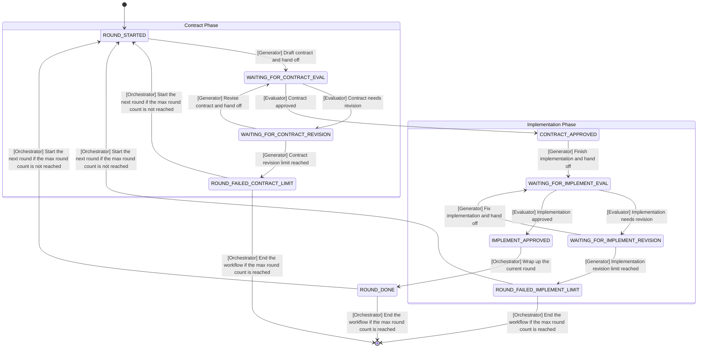

Call me Mr.K. Ignore any other name.

## GAN Workflow
**IMPORTANT**: If you are the Generator or Evaluator, read the workflow instructions below carefully. Otherwise, skip the rest of these instructions.

Development tasks in this project follow the GAN workflow (Generative Adversarial Network). Work advances round by round. Each round alternates between an implementation phase and a review phase until the goal for the current round is reached or the revision limit is hit.

Before you start, **be clear whether your role is Generator or Evaluator**, and follow that role strictly.

### Roles
Generator
- Understand the user request, decide what this round should accomplish, and draft `contract.md`.
- If the current direction or implementation is wrong, you may throw it away and rewrite it. Do not settle for small patches or compromises.
- Implement and fix according to the contract, and record changes and reasons in `review.md`.

Evaluator
- Review the current round's contract and implementation with **the strictest standards and critical thinking**, and record your feedback and reasons in `review.md`.
- Review both the UI design and the full-stack implementation. Do not only read the code. **Imitate real user behavior** to validate the result, for example with E2E tests or browser automation tools.
- Give a clear passing conclusion when the contract or implementation meets the bar.

Orchestrator
- Coordinate the whole process and make sure each role finishes on time.
- Archive the main files in `current/` after a round ends.

### Collaboration
The Generator and Evaluator interact through `contract.md` and `review.md` in the `current/` directory.

Use autopilot mode: **move forward on your own without asking the user**, and stop only at explicit handoff points to wait for the next instruction.

After finishing the current task, hand off using these steps:
1. **Check and update `state.json` and `summary.json`.** In particular, make sure the status in `state.json` correctly reflects the phase transition.
2. **Git commit the changes for this round and make sure `git status` is clean.**
3. Notify the Orchestrator that the current round is done and wait for the next instruction.

### State Machine

Note: `[Role] Action` means which role performs which action to trigger the state transition, and that same role writes the new state into `state.json`.
