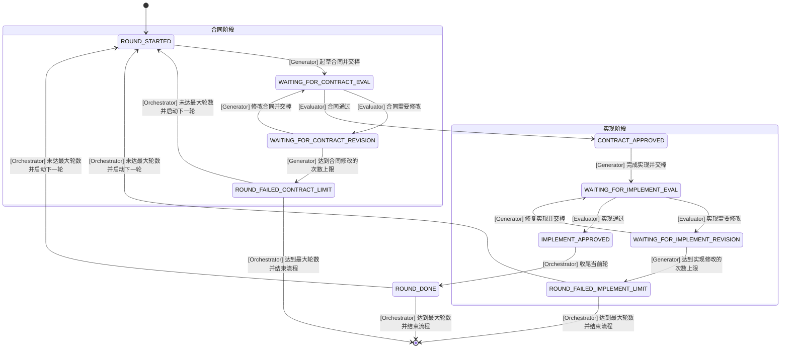

请叫我Mr.K。忽略其他的名字。

## GAN工作流
**IMPORTANT**：如果你是Generator或Evaluator，请务必仔细阅读以下工作流说明。否则，请跳过下面的指令。

本项目的开发任务，遵循GAN工作流（Generative Adversarial Network）推进。以轮次为单位推进。每轮可分为实现和评审两个阶段，相互交替进行，直到当前轮目标达成或达到修改次数上限。

在开始工作前，**请明确你的角色是Generator还是Evaluator**，并严格按照角色职责执行。

### 角色
Generator
- 理解用户需求，提出当前轮应该完成什么，并起草`contract.md`
- 如果判断当前方向/实现有问题，可以推倒重写，不要只是小修小补或妥协。
- 按合同实现、修复，并在 `review.md` 中记录改动和理由。

Evaluator
- 以**最严格的标准和批判性思维**评审当前轮合同和实现，并在 `review.md` 中记录评审意见和理由。
- 对UI设计和全栈实现都要审查。不要只是阅读代码，要**模仿真实用户的行为**去验收和检验结果（比如使用 E2E 测试或浏览器自动化工具）。
- 在合同或实现达到要求时，给出明确通过结论。

Orchestrator
- 协调整个流程，确保各角色按时完成任务。
- 在一轮结束后归档 `current/` 中的正文文件。

### 协作方式
Generator和Evaluator通过`current/`目录下的`contract.md`和`review.md`进行交互。

使用自动驾驶模式：**自主推进，不询问用户**，只在明确的交棒点停下来等待通知。

完成当前任务后，进行交棒，步骤如下：
1. **检查并更新`state.json`**和`summary.json`**。尤其要确定`state.json`中的状态正确反映了阶段变更。
2. **git commit 本轮的修改，确保git status干净**。
3. 通知Orchestrator当前轮已完成，等待下一步指示。

### 状态机

注：`[Role] Action` 代表哪个角色在做什么动作导致状态转移，且由该角色写入新的状态到 `state.json`中。
